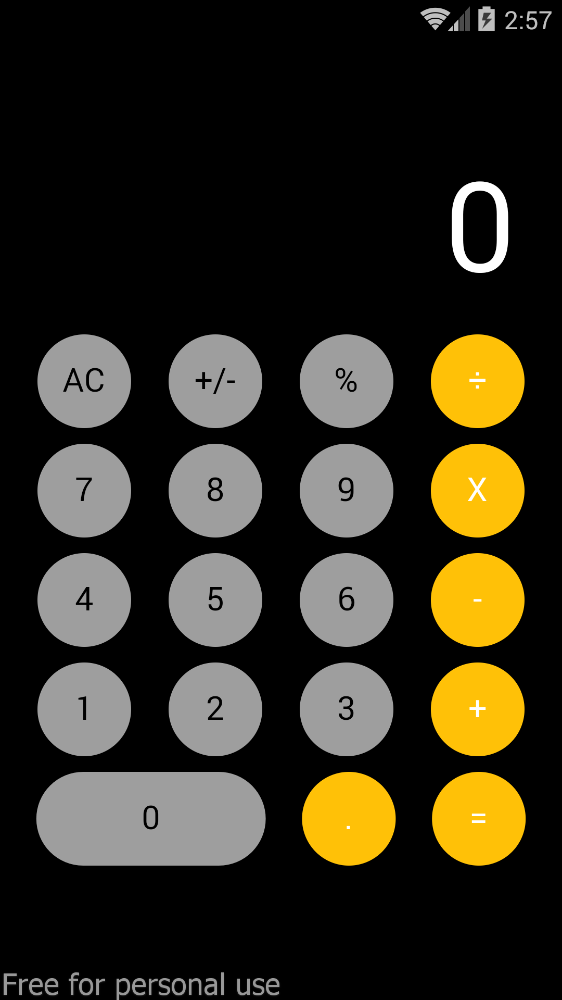
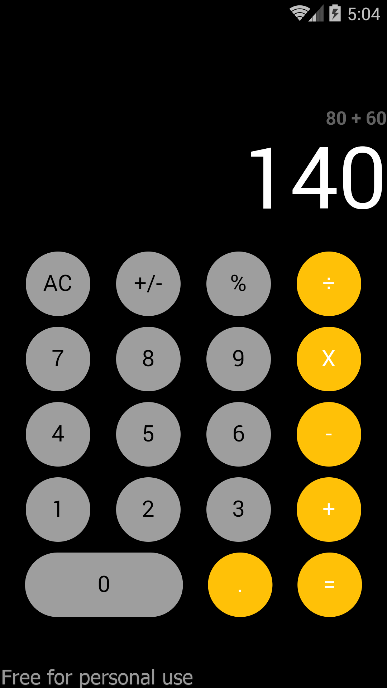
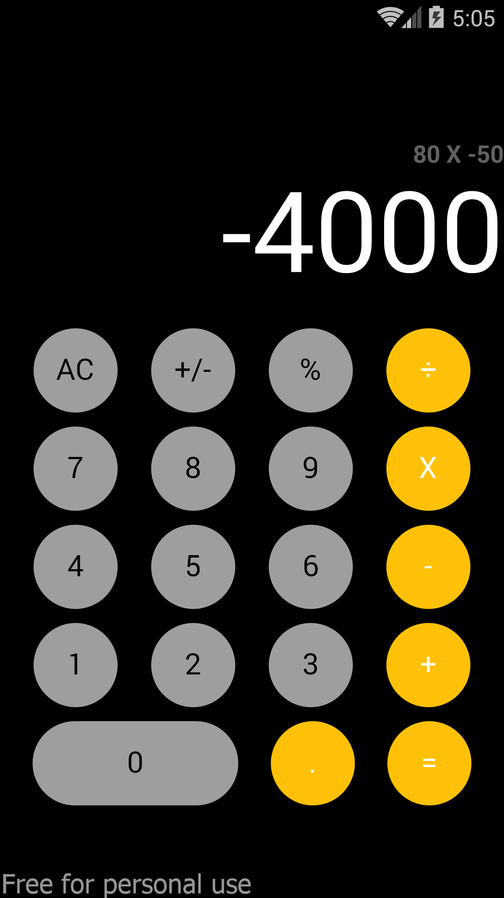

# Flutter - iPhone Calculator Clone
I made a simple iPhone calculator clone with Flutter.

##  What will be add :question:
- [x] . Button
- [x] Multiple transactions

## Screenshots
- 

- 

- 

## Contributing

Contributions are always welcome!
